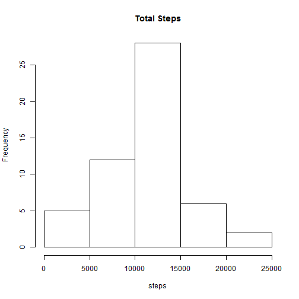
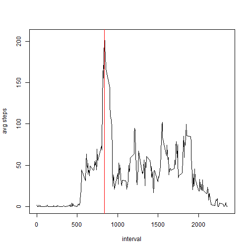
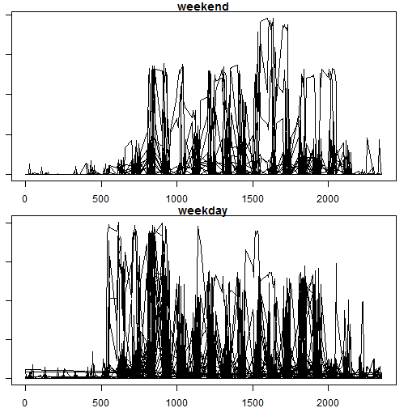

## Setup:


---

## Loading and preprocessing the data


```r
steps <- read.csv('activity.csv')
steps$date <- as.Date(steps$date)
```


```r
str(steps)
```

```
## 'data.frame':	17568 obs. of  3 variables:
##  $ steps   : int  NA NA NA NA NA NA NA NA NA NA ...
##  $ date    : Date, format: "2012-10-01" "2012-10-01" ...
##  $ interval: int  0 5 10 15 20 25 30 35 40 45 ...
```


```r
summary(steps)
```

```
##      steps             date               interval     
##  Min.   :  0.00   Min.   :2012-10-01   Min.   :   0.0  
##  1st Qu.:  0.00   1st Qu.:2012-10-16   1st Qu.: 588.8  
##  Median :  0.00   Median :2012-10-31   Median :1177.5  
##  Mean   : 37.38   Mean   :2012-10-31   Mean   :1177.5  
##  3rd Qu.: 12.00   3rd Qu.:2012-11-15   3rd Qu.:1766.2  
##  Max.   :806.00   Max.   :2012-11-30   Max.   :2355.0  
##  NA's   :2304
```


---

## What is mean total number of steps taken per day?
Ignoring the missing values in the dataset.


```r
data <- aggregate(steps~date, data=steps, sum, na.rm=T)
hist(data$steps, main='Total Steps', xlab='steps')
```




```r
mean(data$steps)
median(data$steps)
```

Mean steps per day is **1.0766189 &times; 10<sup>4</sup>**

Median steps per day is **10765**

---

## What is the average daily activity pattern?


```r
data <- aggregate(steps~interval, data=steps, mean, na.rm=T)
max_steps <- max(data$steps)
interval <- data[data$steps==max_steps, 1 ]
with( data, 
  plot( interval, steps, 
        type='l',
        ylab='avg steps'
  )  )
abline(v=interval, col='red')
```



The 5-minute interval num **835**, on average across all the days in the dataset, contains the maximum number of steps: **206.1698113**

---

## Imputing missing values


```r
sum(is.na(steps$steps))
```

The total number of missing values in the dataset is **2304**.

My strategy for filling in all of the missing values in the dataset:

1. Start by computing the means for each interval with NAs removed.
2. Replace any NA in the data set with the computed mean.

```r
means <- aggregate(steps ~ interval, data=steps, mean, na.rm=T)

steps2 <- steps
steps2$steps <- ifelse(
            is.na(steps2$steps)
            , means[ match(steps2$interval, means$interval), 2]
            , steps2$steps  )
```

After imputation the updated histogram is:

```r
data <- aggregate(steps~date, data=steps, sum, na.rm=T)
hist(data$steps, main='Total Steps', xlab='steps')
```


The new values for median and mean are:

```r
mean(data$steps)
median(data$steps)
```

Mean steps per day is **1.0766189 &times; 10<sup>4</sup>**

Median steps per day is **10765**

The impact of imputing missing data seems **negligable**.

---

## Are there differences in activity patterns between weekdays and weekends?


```r
steps2$weekday <- as.factor(weekdays(steps2$date))
steps2$dayType <- ifelse(steps2$weekday %in% c('Saturday','Sunday'), 'weekend', 'weekday')
unique(steps2[,c(4,5)])
```

```
##        weekday dayType
## 1       Monday weekday
## 289    Tuesday weekday
## 577  Wednesday weekday
## 865   Thursday weekday
## 1153    Friday weekday
## 1441  Saturday weekend
## 1729    Sunday weekend
```


```r
par(mfrow=c(2,1))
par(mar=c(2,1,1,1))
data <- subset(steps2, dayType=='weekend')
with(data, plot(interval, steps, type='l', main='weekend') )

data <- subset(steps2, dayType=='weekday')
with(data, plot(interval, steps, type='l', main='weekday') )
```



Yes, there are differences in activity patterns between weekdays and weekends. The activity pattern for weekdays reflects an earlier start to the day than on the weekend.
